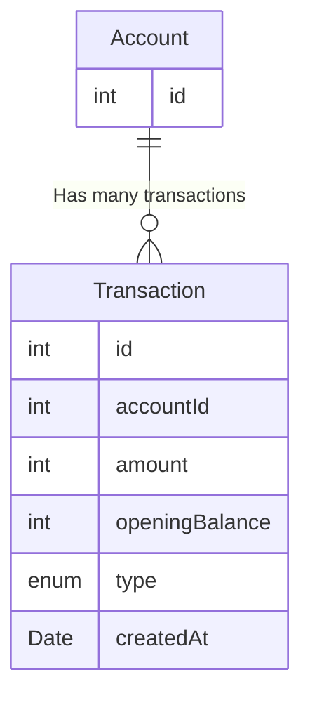
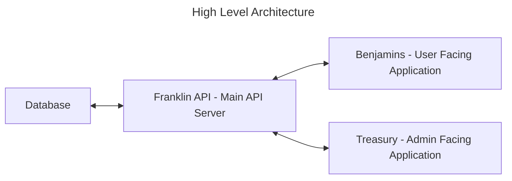
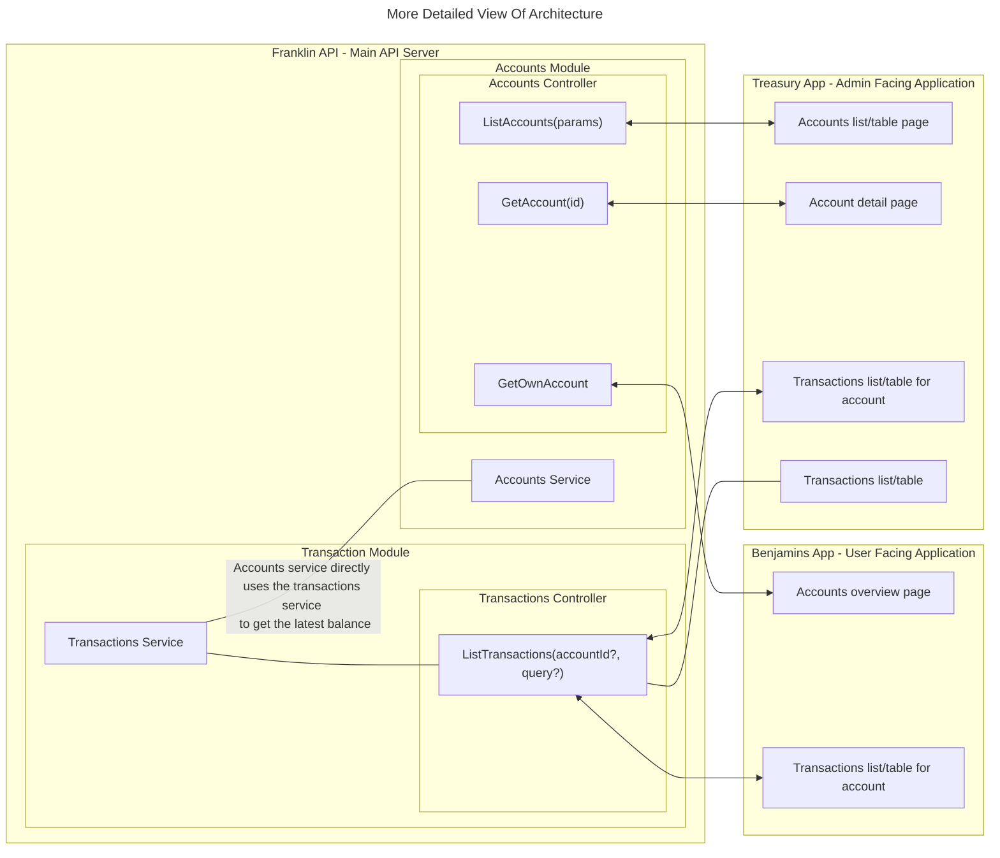

# Benjamins - cNote Example App

## Goals
- [x] Design a database schema to track the user's balance and movements.
- [x] Create a function that 
  - [x] receives a user id (Scope doesnt include users, interpreting as account id)
  - [x] fetches necessary data from the DB you designed
  - [x] returns the amount of interest accrued for the month. Account for one or more balance changes in a single month.
- [x] Create a basic Architecture diagram to illustrate how the different components would interact. 
- [ ] Adding a basic infrastructure diagram is optional but is a plus.
- [x] The DB design can be presented as an *ERD* or as DDL statement(s).

## Scope

- Keep the Database design to the minimum to keep track of balance. Tables like users, logins, money transfers, etc are out of scope for this challenge.
- You may use third party libraries.
- Tests are optional.
- The code will be evaluated on correctness. Optimization is not a must.

## Overview
The main deliverables start in `packages/franklin/src/app/controller.ts`, where we define a get interest endpoint that expects a url such as `http://localhost:3000/interest/8/01-01-2023`

It queries the database through prisma to find transactions for a given account and month and then runs through the `InterestCalculator` class

I had planned to build out a more established monorepo architecture and notes on that are provided below, however I left the skeleton of the `@benjamins/models` package, there are tests for the interest calculator within that.

## Running the project
- Run `npm install` at the root to bootstrap dependencies
- Create `.env` file in `packages/franklin` with `DATABASE_URL=postgres-connection-string`
- Run `cd packages/franklin` and `npx prisma migrate` to migrate the database(requires running postgres instance, not included but would be in a docker compose for local development)
- Run ` npx nx start:dev @benjamins/franklin` to start the nest js server
- Run ` npx nx test @benjamins/models` to test the interest calculator.


## Math, Money & Testing Challenges
I initially began by writing test cases for the interest calculations based on the test cases in the document, however I ran into some challenges...

Specifically I could not get:

```
Applies interest daily based on the balance, if a user deposits $10.000 the first day of the month and then adds an additioinal $5.000 on the fifth of that month the account should accrue $24.38 in interest.
```

To equal 24.38. I initially assumed it was a floating math error, and it might be, but I tried a few online calculators, I tried the calculator on my phone, I tried pencil and paper. 

I caved and installed a financial operaitons library with Dinero.js, and then experimented with different rounding methods.

All of them came out to be $24.39. I left the actual expected result commented out in the test with the value that passes and matches the logic.

## Database Design & Entites
Based on the scope and goals given we have limited needs, a simple schema of two tables fulfills the goals. Certainly others could be added including a Transaction Type schema for enabling more flexibility.

### Designing for Balance
There are a few valid options for designing an accounting app for handling transactions and calculating balances.

1. Store Balance on Account
  - Storing the balance on the account can make sense because most times we want to fetch an account we want to also fetch it's balance.
  - With every Transaction created we would need to either use a database transaction in our application logic that updates the account, or fire a trigger that handles the logic. Using a database transaction would guarantee our application handles the update without error, but if other services were to connect to the database or an update was applied directly to the table we'd have an inaccurate balance. 
2. Transactions Table & Balance View
  - A balance view can sum up each transaction grouped on account ID. For very old and active accounts with many transactions this could become problematic and it makes moving or archiving data more difficult limiting other performance options.
  - A materialized view can mitigate the problem. However it would need to be ran as a triggered action each time a transaction is stored.
3. Store starting balance on each transaction
  - Addresses all of the challenges created in option 1
  - Creates a potential issues around concurrency and sequence of operations

We've chosen to go with option 3 for this.
 

### Entity Relationship Diagram


## Architecture
- Benjamin: Front End UI Application for users
- Treasury: Front End UI Application for admins
- Franklin: Main Application Service
  - Accounts Module
    - Accounts Service
      - List Accounts
      - Get Account
      - Get Own Account
      - Create Account
      - Update Account
      - Delete Account
      - Get Most Recent Transaction?
  - Transactions Module
    - List Transactions
    - List Transactions for Account
    - List Own Transactions
  
### Diagrams



At a high level the system required to satisfy the goals stated are simple, two web based interfaces and an application server to provide data and interaction points.

---



### Organization
Our goals with organization are to make it easy enough to spin up new applications that its the default — within reason, and to be able to reverse that decision and destruct one micro service into another if decided appropiate.

Everything is organized assuming a primarily node based application though there are patterns enforced that allow for easily integrating services of any language. Namely, each deployable application requires a Dockerfile and a Dockerfile.dev.

Internal code is built out in packages to be used within applications. 

Anything not specified in the example below is at the discretion of the developer, guided by the patterns of the frameworks in use and layer being implemented.

```
- .github/ :: Github actions is the CI/CD tool chosen, store tasks here.
- apps/ :: 
  - $app-name/
    - __tests
    - src/
    - package.json
    - Dockerfile
    - Dockerfile.dev
    - readme.md
    - .env
    - .env.example
- packages/
  - $package-name
    - __tests
    - src/
    - package.json
    - readme.md
- infrastructure/ :: Infrastructure managed with Pulumi (or terraform)
- nx.json
- package.json
- readme.md
```

### Applications

### Packages
- models: Package for Prisma management. I started implementing this and realized it would require more work than worth it to manage the sim linking that prisma does, moved the relevant code directly into the franklin-api app.

### Libraries
- Nx: Monorepo management
- SWC: Very Fast Typescript Compiler
- NestJS: API Application Framework
- NextJS: User Interface Framework
- JestJS: Testing Framework
- Prisma: ORM & Migrations


## Infrastructure
- AWS ECS
- AWS EC2(?)
- AWS EKS?
- AWS RDS Postgres

## Naming
I chose to go with somewhat fun names that are not overly specific but carry implications. That is, the main applications are a breakdown of Benjamin Franklin. This is a play on cNote's name which is also slang for a $100 bill. The frontend is front end, the backend is the last name. 

This is to avoid being overly specific in the module boundaries, allowing for scope changes and increasing velocity.

In a multi-cultural distributed team the context may be missed however, so the package and application names need to be documented.

https://betterprogramming.pub/software-component-names-should-be-whimsical-and-cryptic-ca260b013de0


